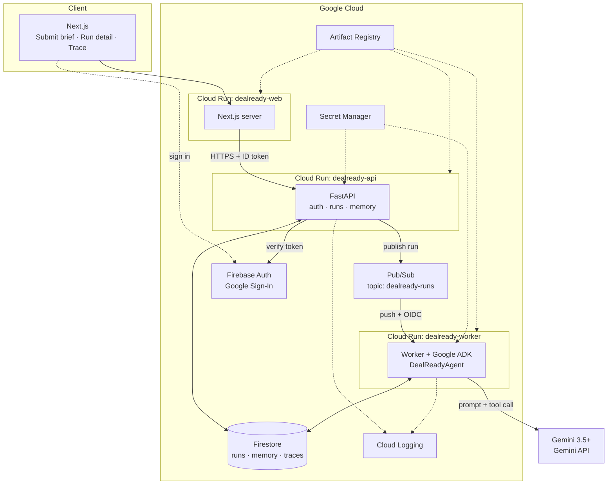
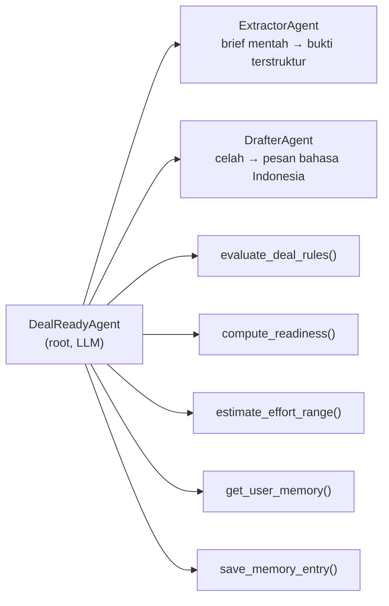
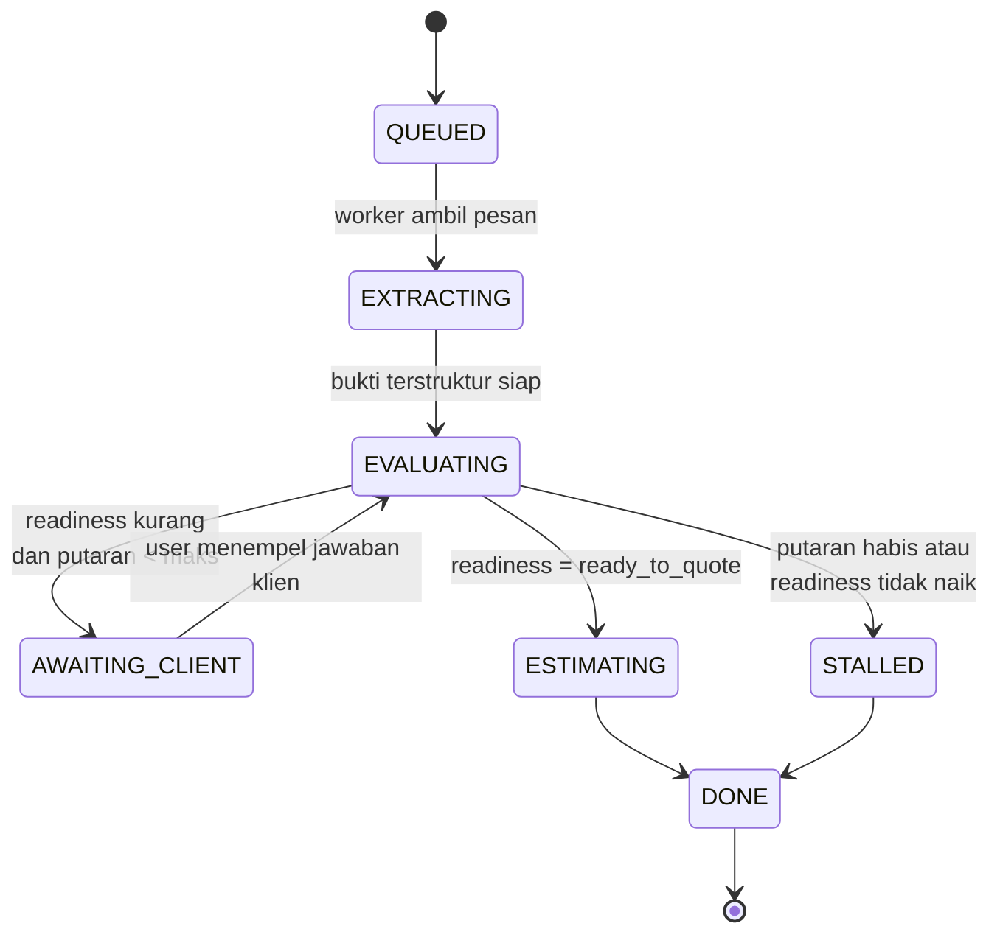
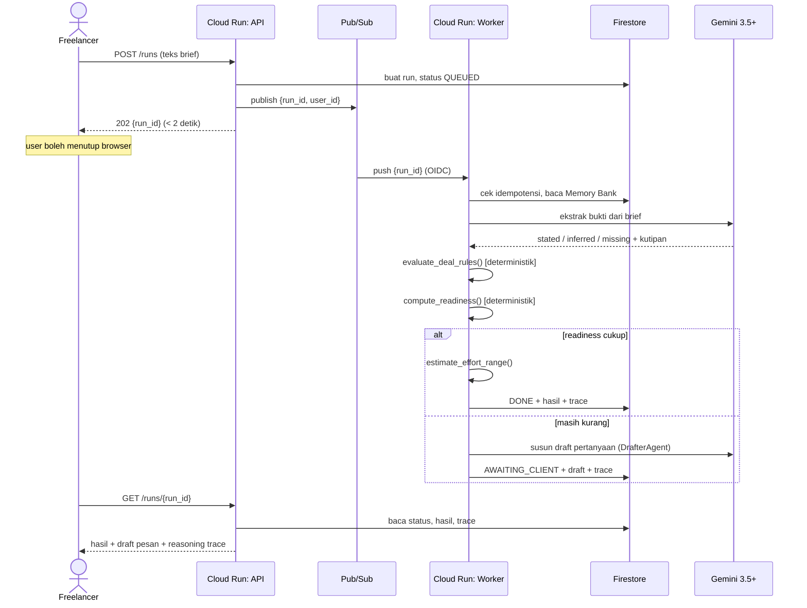

# 02 — Arsitektur & Desain Teknis

**Status:** rancangan greenfield. Belum ada satu pun komponen yang dibangun.
Detail API framework ditandai `[verifikasi]` — cek dokumentasi resmi sebelum
menulis kode. **Jangan menyalin signature dari dokumen ini sebagai kebenaran.**

---

## 1. Bentuk sistem

Semua komponen baru. Tidak ada warisan, tidak ada data lama yang harus
dikompromikan — ini keuntungan besar dari memulai project terpisah, dan
menghasilkan cerita arsitektur yang bersih di depan juri: **seluruh sistem
berjalan di Google Cloud.**



### Layanan Google Cloud yang dipakai

| Layanan | Peran | Status syarat |
|---|---|---|
| **Cloud Run** | Tiga service: `web`, `api`, `worker` | Memenuhi syarat infra GCP |
| **Pub/Sub** | Antrean run; push subscription ke worker | Inti eksekusi asinkron |
| **Firestore** | Satu-satunya datastore: run, memory, trace | State management |
| **Firebase Auth** | Google Sign-In, verifikasi ID token | Identitas user |
| **Secret Manager** | API key Gemini dan kredensial lain | Poin security |
| **Artifact Registry** | Image container | Konsekuensi Cloud Run |
| **Cloud Logging** | Log terstruktur berkorelasi `run_id` | Observability |

**Tidak ada database di luar GCP.** Ini disengaja: satu datastore, satu cerita,
tidak ada yang perlu dijelaskan sebagai pengecualian.

## 2. Stack

| Lapisan | Pilihan | Alasan |
|---|---|---|
| Frontend | Next.js (App Router) + TypeScript + Tailwind | Stack default Rifqi; paling cepat baginya |
| Backend API | Python 3.12 + FastAPI + Pydantic v2 | Satu bahasa dengan ADK; menghindari lintas-bahasa |
| Agent | **Google ADK (Python)** | Syarat wajib panitia; Python-first |
| Model | **Gemini 3.5+** via Gemini API | Syarat wajib. `[verifikasi]` ID model |
| Datastore | Firestore (mode Native) | Serverless, tanpa server yang dikelola |
| Antrean | Pub/Sub push | Decoupling yang dinilai juri |
| Test | pytest | Bukti production readiness |

Catatan: backend Python meski frontend TypeScript. Ini disengaja — ADK adalah
Python-first, dan memaksakan satu bahasa akan mengorbankan syarat wajib.

## 3. Desain agent

### 3.1 Struktur

Satu root agent yang mengorkestrasi, dua sub-agent, dan tool deterministik.



**Pembagian tugas yang tidak boleh dilanggar:**
LLM hanya mengekstrak dari teks, memutuskan langkah berikutnya, dan menyusun
bahasa. Semua penilaian dan angka — celah, skor risiko, readiness, rentang
effort — keluar dari fungsi Python deterministik yang dipanggil sebagai tool.

Kenapa ini penting melebihi soal selera: hasilnya jadi **reproducible dan bisa
diaudit**. Input yang sama menghasilkan penilaian yang sama, terlepas dari
suasana hati model. Ini yang akan ditunjukkan di video sebagai pembeda.

### 3.2 Tool yang diekspos

| Tool | Isi | Deterministik |
|---|---|---|
| `evaluate_deal_rules(evidence)` | 10–12 aturan celah brief (lihat 3.4) | Ya |
| `compute_readiness(evidence, issues)` | Memetakan celah ke 3 readiness state | Ya |
| `estimate_effort_range(evidence)` | Rentang jam untuk video short-form; menolak kalau data kurang | Ya |
| `get_user_memory(user_id)` | Baca Memory Bank dari Firestore | Ya |
| `save_memory_entry(user_id, entry)` | Tulis koreksi/preferensi | Ya |

Tidak ada tool yang mengirim apa pun keluar sistem. Disengaja — lihat bagian 7.

### 3.3 Loop klarifikasi



**Pengaman loop — wajib, ini yang membedakan agent dari pembakar kuota:**

| Pengaman | Nilai |
|---|---|
| `MAX_ROUNDS` | 3 |
| Berhenti kalau readiness tidak naik setelah satu putaran | Ya — laporkan jujur ke user |
| `MAX_TOOL_CALLS_PER_ROUND` | 12 |
| Batas waktu total per run | 5 menit |
| Maksimal pertanyaan per putaran | 5 |

Setiap pengaman ini harus punya test. Juri di kriteria arsitektur mencari bukti
bahwa agent-nya dikendalikan, bukan dibiarkan liar.

### 3.4 Aturan deal deterministik

Ditulis fresh, bukan disalin. Sekitar 10–12 aturan, tiap aturan menghasilkan
issue dengan bobot risiko:

| Kelompok | Aturan |
|---|---|
| Deliverable | Jumlah output tidak jelas; format/rasio tidak disebut; durasi akhir tidak disebut |
| Input | Footage/bahan belum tentu ada; siapa penyedia bahan tidak jelas |
| Proses | Jumlah putaran revisi tidak dibatasi; jumlah approver tidak jelas; kriteria "selesai" tidak terdefinisi |
| Waktu | Deadline tanpa tanggal pasti; kondisi mulai bergantung pihak lain |
| Komersial | Budget disebut tanpa scope terkunci; biaya langsung (stock, musik) tidak dibahas; termin pembayaran tidak disebut |
| Perubahan | Batas perubahan di luar scope tidak didefinisikan |

Readiness dihitung dari bobot issue yang masih terbuka — bukan dari opini LLM.

## 4. Alur satu run



## 5. Model data (Firestore)

Empat koleksi. Sengaja minimal.

### `users/{user_id}`
```
email            string
display_name     string
created_at       timestamp
```

### `runs/{run_id}`
```
user_id          string
status           QUEUED | EXTRACTING | EVALUATING | AWAITING_CLIENT
                 | ESTIMATING | STALLED | DONE | FAILED
round            int
max_rounds       int
brief_original   string
rounds[]         array   -- per putaran: input klien, bukti, issue, readiness
questions[]      array   -- pertanyaan putaran terakhir
draft_message    string | null
result           object | null
error            object | null
idempotency_key  string  -- mencegah pemrosesan ganda dari Pub/Sub
created_at       timestamp
updated_at       timestamp
```

### `memory/{user_id}`
Inilah yang membuat agent "berkembang dari feedback".
```
preferences{}       map     -- misal: selalu minta tanggal deadline eksplisit
corrections[]       array   -- koreksi user atas output agent
client_patterns{}   map     -- per klien: telat approve, revisi membengkak
outcomes[]          array   -- deal jadi/tidak, scope creep terjadi/tidak
updated_at          timestamp
```

### `traces/{run_id}/steps/{step_id}`
```
seq              int
kind             llm_call | tool_call | decision
name             string
input_summary    string   -- diringkas, PII diredaksi
output_summary   string
rationale        string   -- kenapa langkah ini diambil
latency_ms       int
token_usage      object | null
created_at       timestamp
```

**Aturan isolasi:** setiap query Firestore wajib difilter `user_id` yang berasal
dari **ID token terverifikasi**, tidak pernah dari body request. Harus ada test
yang membuktikan user A tidak bisa membaca run, memory, atau trace user B.

## 6. Keputusan teknis

Format: keputusan → alasan → konsekuensi.

**D-1 — Project baru, terpisah total dari Baseline.**
Alasan: memenuhi aturan "newly created" tanpa perdebatan, menghindari benturan
dengan kontes lain, dan menghindari pertanyaan kepemilikan repo. Konsekuensi:
tidak ada kode yang bisa dipakai ulang; semua ditulis dari nol. Boleh membaca
Baseline sebagai referensi konsep, **tidak boleh menyalin kode**.

**D-2 — Google ADK sebagai agent framework.**
Alasan: syarat wajib panitia; Python-first sehingga menyatu dengan FastAPI.
Konsekuensi: ada kurva belajar. `[verifikasi]` bentuk definisi agent, tool, dan
loop harus dicek ke dokumentasi resmi — jangan menulis dari ingatan.
**Mitigasi:** Hari 1 disediakan khusus untuk "hello world" ADK sebelum menyentuh
domain, supaya kurva belajarnya tidak menabrak hari terakhir.

**D-3 — Worker terpisah dari API, disambung Pub/Sub.**
Alasan: tema hackathon menuntut eksekusi asinkron di background, dan juri menilai
*decoupling*. Menjalankan agent di dalam request handler gagal di dua kriteria
sekaligus. Konsekuensi: dua service, satu topic, satu push subscription. Worker
**wajib idempoten** karena Pub/Sub menjamin *at-least-once delivery* — pesan bisa
datang dua kali, dan tanpa pengaman itu satu brief bisa diproses ganda.

**D-4 — Firestore sebagai satu-satunya datastore.**
Alasan: serverless, tanpa server dikelola, dan menghasilkan cerita "semuanya di
GCP" yang bersih. Konsekuensi: model data harus dirancang untuk dokumen, bukan
relasional. Untuk skala ini tidak masalah.

**D-5 — Firebase Auth untuk identitas.**
Alasan: membangun auth sendiri memakan waktu yang tidak kita punya, dan Firebase
Auth adalah layanan Google. Konsekuensi: FastAPI memverifikasi ID token.

**D-6 — Gemini API dulu, Vertex AI kalau sempat.**
Alasan: Gemini API cukup API key; Vertex butuh setup IAM lebih banyak. Keduanya
sah menurut aturan. Konsekuensi: kalau waktu tersisa, pindah ke Vertex karena
lebih meyakinkan sebagai cerita produksi.

**D-7 — Next.js untuk frontend, di Cloud Run.**
Alasan: stack default Rifqi, jadi paling cepat. Menaruhnya di Cloud Run menjaga
cerita all-GCP. Konsekuensi: satu service tambahan. **Fallback kalau deploy-nya
merepotkan:** Firebase Hosting.

## 7. Security

| Kontrol | Catatan |
|---|---|
| Teks klien diperlakukan sebagai data, bukan instruksi | Dinyatakan tegas di system prompt; **wajib ada test injeksi** (US-6) |
| Field `stated` wajib kutipan verbatim | Divalidasi di kode setelah LLM merespons, bukan dipercaya begitu saja |
| Redaksi PII sebelum masuk trace | Trace ditampilkan di UI, jadi jangan menyimpan mentah |
| Secret di Secret Manager | Bukan env var plaintext di Cloud Run |
| Isolasi per-user di Firestore | Filter dari ID token terverifikasi; wajib ada test |
| Idempotensi endpoint worker | Pub/Sub at-least-once |
| Endpoint worker hanya menerima Pub/Sub terautentikasi | Push subscription dengan OIDC service account |
| Rate limit per user di `POST /runs` | Mencegah pembakaran kuota Gemini |

Ancaman yang paling nyata: **prompt injection lewat brief klien**, karena
inputnya memang teks dari orang asing. Sekarang agent punya tool, jadi taruhannya
naik — injeksi yang berhasil bukan cuma bikin output salah, tapi bisa memicu
pemanggilan tool. Karena itu tidak ada satu pun tool yang punya efek samping
keluar sistem: pengiriman pesan ke klien selalu lewat aksi manual user.

## 8. Observability

- Semua log terstruktur membawa `run_id`, `user_id`, `round`.
- Reasoning trace disimpan di Firestore **dan ditampilkan di UI**. Ini bukan
  hanya alat debug — ini bahan demo terkuat, karena juri bisa melihat agent
  berpikir dan memverifikasi bahwa angkanya datang dari tool, bukan dari LLM.
- Metrik minimum per run: jumlah putaran, jumlah tool call, latensi, token.

## 9. Peta ke syarat hackathon

| Syarat panitia | Dipenuhi oleh |
|---|---|
| Gemini 3.5+ | `DealReadyAgent` + sub-agent (bagian 3) |
| Google Agent Framework | Google ADK (D-2) |
| Layanan Google Cloud | Cloud Run, Pub/Sub, Firestore, Firebase Auth, Secret Manager |
| Otonom & asinkron | Pub/Sub + worker terpisah (D-3), loop klarifikasi (3.3) |
| Diagram arsitektur | Diagram bagian 1 — diekspor jadi PNG untuk submission |
| Architectural discipline | Pemisahan AI/kalkulasi (3.1), decoupling (D-3), pengaman loop (3.3), test |
| Demo & production readiness | Trace di UI (bagian 8), README, test, deploy nyata |
