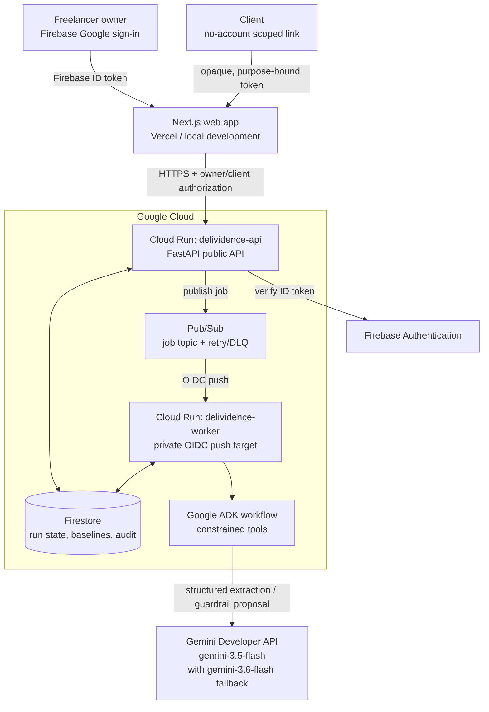

# Delividence architecture diagram

### Authority boundaries

- Gemini proposes structured ledger fields and scope classifications; deterministic domain services verify source quotes, readiness, versioning, hashes, and every final approval.
- The owner is authenticated with Firebase. Client portals use hashed, expiring, purpose-bound opaque links and do not require a client account.
- The public API publishes work; a private Cloud Run worker receives authenticated Pub/Sub delivery and writes the resulting state and audit events back to Firestore.
- The current submission workflow accepts brief text and URL/text evidence. It does **not** claim automatic binary image, audio, or video analysis.
